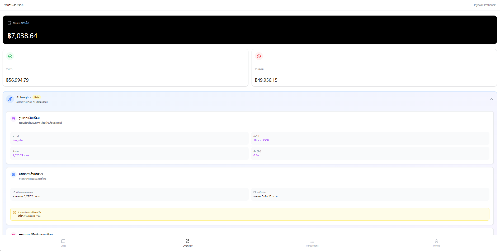

# 💰 Finance Dashboard

เว็บแอปพลิเคชันสำหรับบริหารจัดการการเงินส่วนบุคคลที่ทันสมัยและใช้งานง่าย ช่วยให้คุณติดตามรายรับ-รายจ่าย และวางแผนทางการเงินได้อย่างมีประสิทธิภาพ พัฒนาด้วย Next.js และ Tailwind CSS



## ✨ ฟีเจอร์หลัก (Features)

- 📊 **ภาพรวมทางการเงิน (Financial Overview)**: แสดงสรุปยอดเงินคงเหลือ รายรับ และรายจ่าย ในรูปแบบกราฟที่เข้าใจง่าย
- 💰 **จัดการธุรกรรม (Transaction Management)**: บันทึกและดูรายการเดินบัญชี ย้อนหลังได้อย่างละเอียด
- 🤖 **AI ผู้ช่วย (AI Assistant)**: แชทบอทอัจฉริยะที่พร้อมให้คำแนะนำและตอบคำถามเรื่องการเงิน
- 👤 **จัดการโปรไฟล์ (Profile Management)**: ปรับแต่งข้อมูลส่วนตัวและการตั้งค่าการใช้งาน
- 🔐 **ระบบความปลอดภัย (Secure Authentication)**: เข้าสู่ระบบอย่างปลอดภัยด้วย NextAuth.js
- 🌓 **โหมดมืด/สว่าง (Dark/Light Mode)**: รองรับการแสดงผลทั้งโหมดกลางวันและกลางคืน (ตามการตั้งค่าระบบ)

## 🛠️ เทคโนโลยีที่ใช้ (Built With)

- [Next.js 16](https://nextjs.org/) - เฟรมเวิร์ก React ที่ทรงพลัง
- [Tailwind CSS v4](https://tailwindcss.com/) - เครื่องมือตกแต่งสไตล์ที่ยืดหยุ่น
- [Radix UI](https://www.radix-ui.com/) - คอมโพเนนต์ UI ที่เข้าถึงง่ายและปรับแต่งได้
- [Lucide React](https://lucide.dev/) - ชุดไอคอนที่สวยงาม
- [NextAuth.js](https://next-auth.js.org/) - ระบบยืนยันตัวตนที่ครบครัน
- [Axios](https://axios-http.com/) - สำหรับการเชื่อมต่อ API

## 🚀 การเริ่มต้นใช้งาน (Getting Started)

### สิ่งที่ต้องมี (Prerequisites)

- Node.js 18.x หรือใหม่กว่า
- npm, yarn, pnpm หรือ bun

### การติดตั้ง (Installation)

1. Clone repository:
```bash
git clone https://github.com/your-username/finance-dashboard.git
cd finance-dashboard
```

2. ติดตั้ง dependencies:
```bash
npm install
# หรือ
yarn install
# หรือ
pnpm install
# หรือ
bun install
```

3. สร้างไฟล์ `.env` ในโฟลเดอร์หลัก:

```env
# Google Credentials
GOOGLE_CLIENT_ID=
GOOGLE_CLIENT_SECRET=

# NextAuth Config
# NEXTAUTH_URL=
NEXTAUTH_URL=http://localhost:3000
NEXTAUTH_SECRET=

# Backend API
NEXT_PUBLIC_API_URL=
```

4. รัน Development Server:
```bash
npm run dev
# หรือ
yarn dev
# หรือ
pnpm dev
# หรือ
bun dev
```

5. เปิด [http://localhost:3000](http://localhost:3000) ในเบราว์เซอร์ของคุณ

## 📝 การใช้งาน (Usage)

1. **หน้าภาพรวม (Overview):** ดูสรุปสถานะทางการเงินของคุณได้ทันทีที่เข้าสู่ระบบ
2. **รายการธุรกรรม (Transactions):** เพิ่ม ลบ หรือแก้ไขรายการรายรับ-รายจ่าย
3. **AI Chat:** สอบถามข้อมูลหรือขอคำแนะนำทางการเงินจาก AI
4. **โปรไฟล์ (Profile):** แก้ไขข้อมูลส่วนตัวและตั้งค่าบัญชี

## 👏 กิตติกรรมประกาศ (Acknowledgments)

- [Vercel](https://vercel.com) สำหรับแพลตฟอร์มการโฮสต์ที่ดีเยี่ยม
- ชุมชน Open Source สำหรับเครื่องมือและไลบรารีต่างๆ
